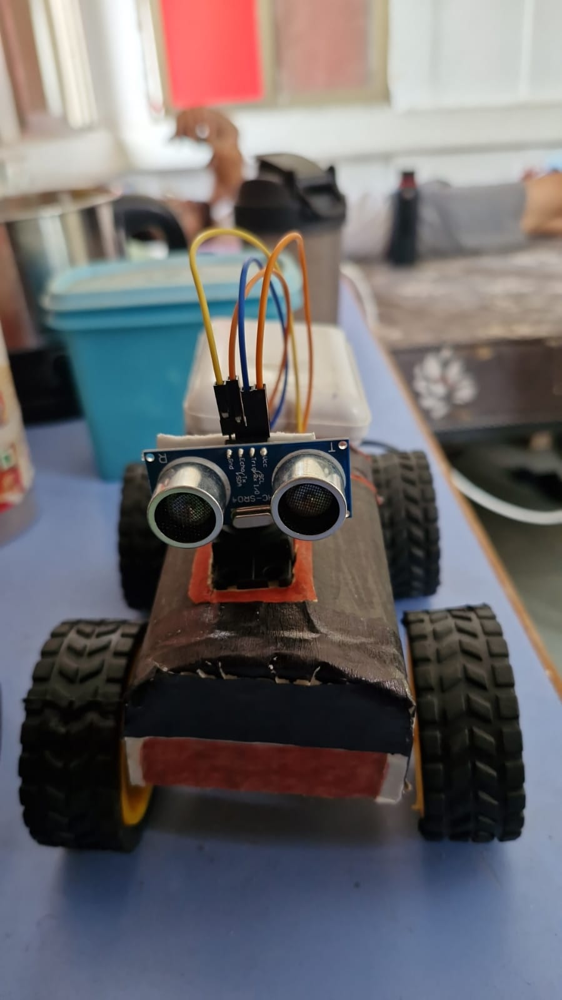
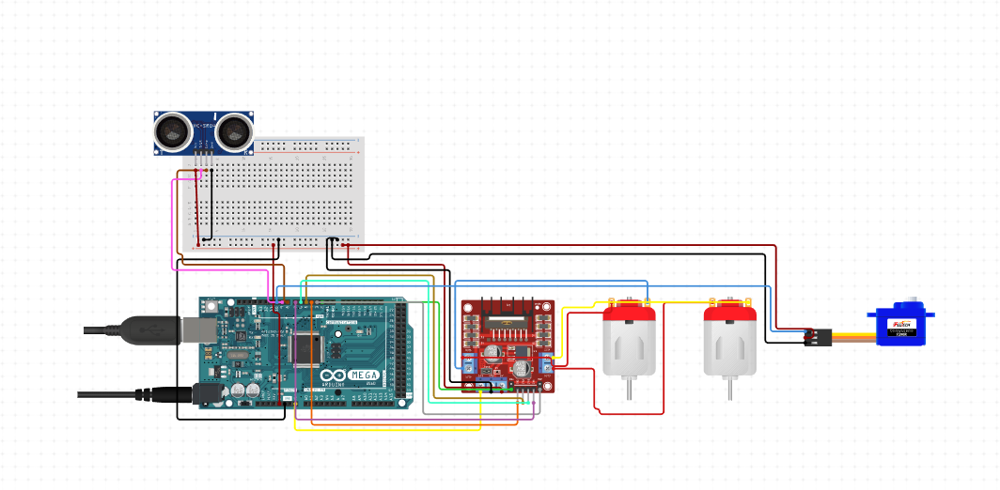

# Object-Avoidance-Car using Arduino Mega 2560

## **1. Introduction**

This project involves the development of an autonomous robot car that can detect and avoid obstacles using an ultrasonic sensor mounted on a servo motor. The robot is driven by two DC motors controlled via an L298N motor driver, with an Arduino Mega serving as the control unit.

---

## **2. Components Used**

| Component                             | Quantity    | Description                                          |
| ------------------------------------- | ----------- | ---------------------------------------------------- |
| Arduino Mega 2560                     | 1           | Microcontroller to control the system                |
| L298N Motor Driver                    | 1           | Drives the two DC motors                             |
| Ultrasonic Sensor (HC-SR04)           | 1           | Used to measure distance to obstacles                |
| Servo Motor (SG90)                    | 1           | Rotates the ultrasonic sensor to scan left and right |
| DC Motors + Wheels                    | 2           | For movement (connected to L298N)                    |
| Chassis                               | 1           | Robot body                                           |
| Power Supply (Battery Pack - 7.4V/9V) | 1           | Powers the system                                    |
| Jumper Wires                          | As required | For connections                                      |

---

## **3. Circuit Diagram**

---

